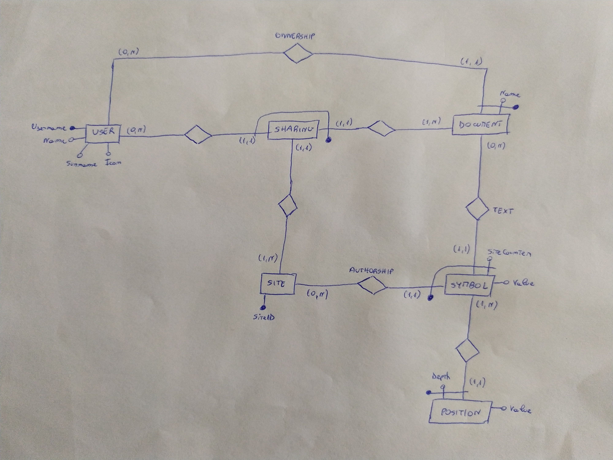

# Database

## Conceptual schema

## Logical schema

### Tables
User(**username**, name, surname, icon)  
Document(**owner**, **name**, sharing_link)  
Site(**site_id**)  
Symbol(**symbol_id**, document_owner, document_name, site_id, site_counter, value)  
PositionNode(**symbol_id**, **depth**, value)  
Sharing(**sharing_id**, sharing_user, document_owner, document_name, site_id, site_counter>  

### Referential integrity constraints
Document(owner) REFERENCES User(username)  
Symbol(site_id) REFERENCES Site(site_id)  
Symbol(document_owner, document_name) REFERENCES Document(owner, name)  
PositionNode(symbol_id) REFERENCES Symbol(symbol_id)  
Sharing(sharing_user) REFERENCES User(username)  
Sharing(document_owner, document_name) REFERENCES Document(owner, name)
Sharing(site_id) REFERENCES Site(site_id)  
