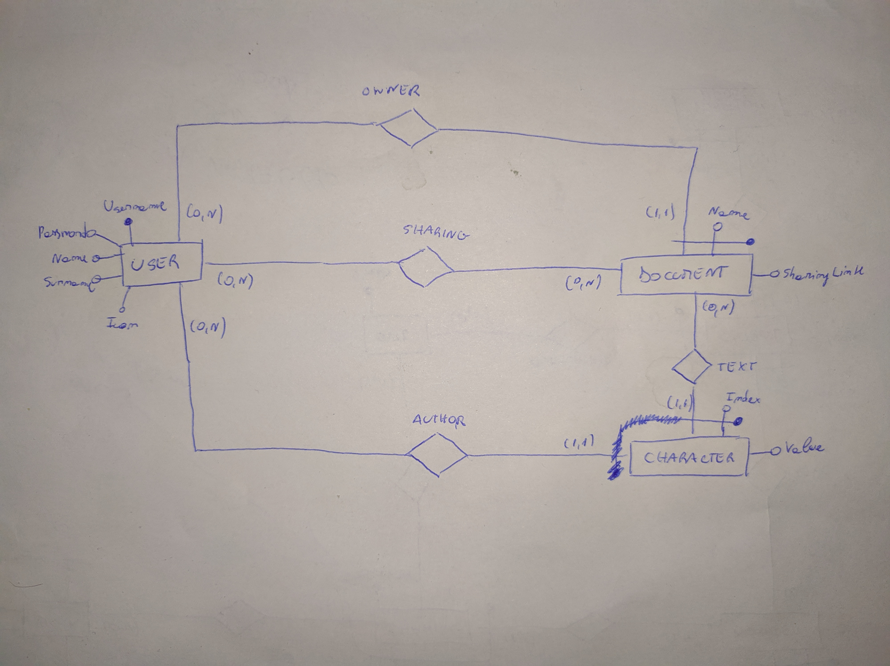

# Database

## Conceptual schema

## Logical schema

### Tables
User(<ins>username</ins>, name, surname, icon)  
Document(<ins>owner</ins>, <ins>name</ins>)  
Site(<ins>site_id</ins>)  
Symbol(<ins>symbol_id</ins>, document_owner, document_name, site_id, site_counter, value)  
PositionNode(<ins>symbol_id</ins>, <ins>depth</ins>, value)  
Sharing(<ins>sharing_user</ins>, <ins>document_owner</ins>, <ins>document_name</ins>, site_counter>  

### Referential integrity constraints
Document(owner) REFERENCES User(username)  
Symbol(site_id) REFERENCES Site(site_id)  
Symbol(document_owner, document_name) REFERENCES Document(owner, name)  
PositionNode(symbol_id) REFERENCES Symbol(symbol_id)  
Sharing(sharing_user) REFERENCES User(username)  
Sharing(document_owner, document_name) REFERENCES Document(owner, name)
