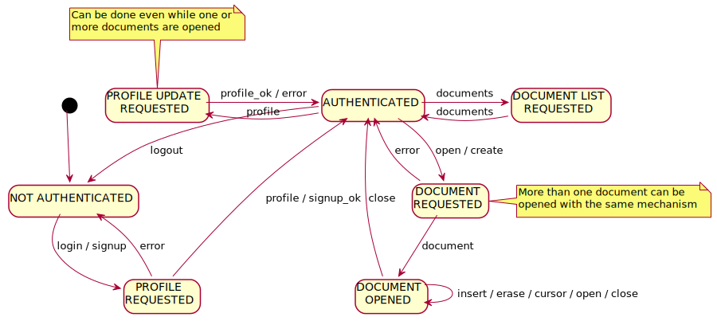

# Application protocol

## State diagram

## Message types
Here are the fields and the explanation of each message type appearing in the state diagram:
- *error \<reason>* : either a runtime error due to user input or a programming error due to bug.
- *signup \<profile> \<password>* : client requests to create a new account.
- *signup_ok* : server confirms success of signup.
- *login \<username> \<password>* : client requests to log in with an existing account.
- *logout* : client logs out.
- *profile \<profile> [\<password>]* : client requests a profile update.
- *profile_ok* : server confirms success of profile update.
- *documents [\<list_of_documents>]* : client requests (without optional argument) or server sends (with optional argument) list of documents accessible by the client (created or obtained with sharing link).
- *create \<document_name>* : client requests to create a new document.
- *open \<document|sharing_link> [\<site_id> \<profile>]* : client requests to open an existing document (without optional arguments) or server notifies a new user with access to the document (with *\<document>* and optional arguments).
- *close \<document> [\<username>]* : client requests to close an opened document (without optional argument) or server notifies a close to the other editing users (with optional argument).
- *document \<document> \<document_data>* : server sends all the info about the requested (open/create) document.
- *insert \<document> \<symbol>* : insert symbol in an opened document.
- *erase \<document> \<symbol>* : erase symbol from an opened document.
- *cursor \<document> \<symbol> [\<username>]* : move cursor of a client in an opened document (client to server without optional argument, server to client with optional argument).

Further details:
- *\<document>* contains: *owner* (username) and *document_name*.
- *\<symbol>* contains: *site_id*, *site_counter*, *value*, and *position* (array of integers).
- *\<profile>* contains: *username*, *name*, *surname*, and *icon*.
- *\<document_data>* contains:
	+ *text* (array of symbols)
	+ *site_id* and *site_counter* assigned to the client opening the document
	+ map *username* -> *profile* for all the users with access to the document (including who is opening/creating)
	+ map *username* -> *symbol* (cursors) for all the online users editing the document
	+ map *username* -> list of *site_ids* for all the users with access to the document (including who is opening/creating)
	+ *sharing_link*
